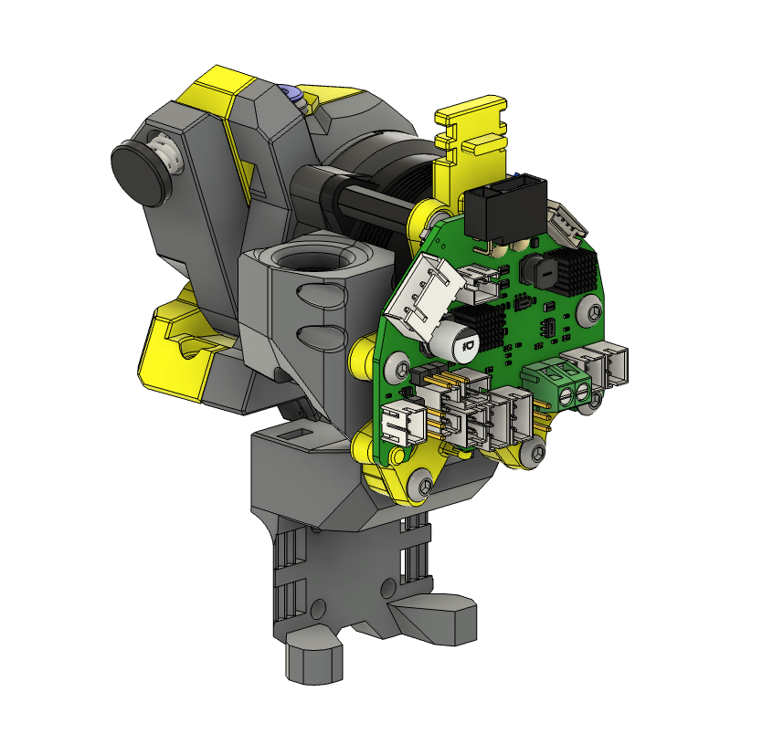
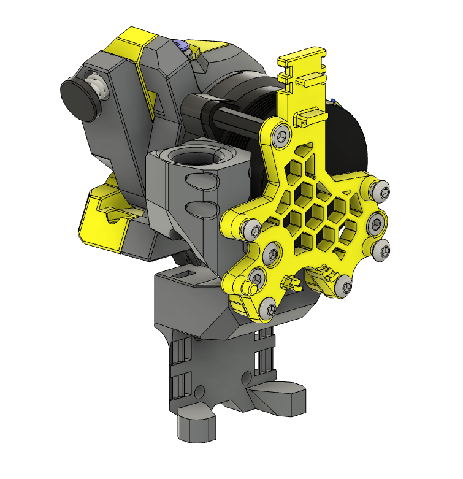
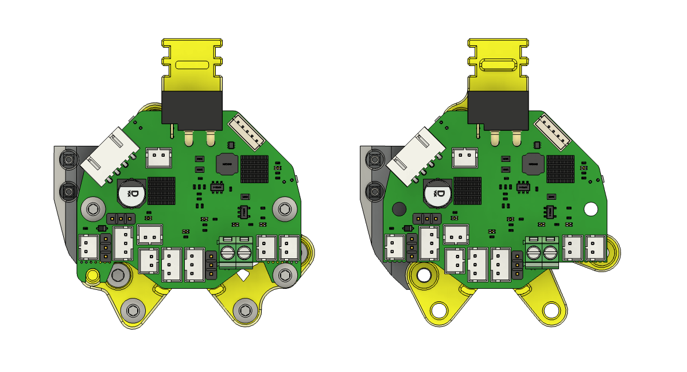

# 🦾 AntHead Nighthawk36 Toolhead Board Mount  
### *Because hexagons are the bestagons.*

---

## 🔧 Overview  
A compact, rigid mount designed for **[AntHead](https://github.com/PrintersForAnts/AntHead) & Nighthawk36 (NH36)** toolhead PCB.  
It provides six solid mounting points and integrated standoffs to increase rigidity of the board, and reduce strain on the umbilical connection.  

---

## 🧼 Features  
- 🪛 **Six points of contact**, including the rear of the X-carriage for increased stability.  
- 🔄 **Two versions available** — one for NH36 boards with tabs, and one for when tabs are removed.  
- 🧱 **Supports both 18 mm and 20 mm standoffs**, 18mm to increase clearance to the Z-Chain on Micron R1.   
- 🔌 **Built-in standoffs and support ribs** for both the NH36 board and the main plug/socket — improving overall stability and umbilical cable security.  

---

## 🖨️ Print Settings  

**All STLs should be pre-oriented for printing.**

- **Material:** ABS or ASA
- **Layer height:** 0.20 mm (including first layer)
- **Wall count:** 4
- **Extrusion width:** 0.40 mm (forced)
- **Top/bottom solid layers:** 5
- **Infill:** 40% (Grid, Gyroid, Honeycomb, Triangle, or Cubic)
- **Supports:** Not required

---

## 📦 Bill of Materials (BOM)

| Qty | Item | Notes / Link |
|:--:|:--|:--|
| x3 | M3x8 BHCS | [AliExpress](https://s.click.aliexpress.com/e/_EuZgLr4) |
| x3 | M3x8 SHCS | [AliExpress](https://s.click.aliexpress.com/e/_EysBYgO) |
| x2 | M3x12 BHCS | [AliExpress](https://s.click.aliexpress.com/e/_EjIMmJy) |
| x1 | M3x35 BHCS | [AliExpress](https://s.click.aliexpress.com/e/_EGqYLuE) |
| x1 | M3x18 mm Standoff | [AliExpress](https://s.click.aliexpress.com/e/_Evwibbo) |
| x3 | 4x5 Heatset Insert (Voron spec) | [AliExpress](https://s.click.aliexpress.com/e/_EuBQ66m) |

---

## 🗓️ Version History  

### 04 Oct 2025  
- 🆕 Initial release  

---