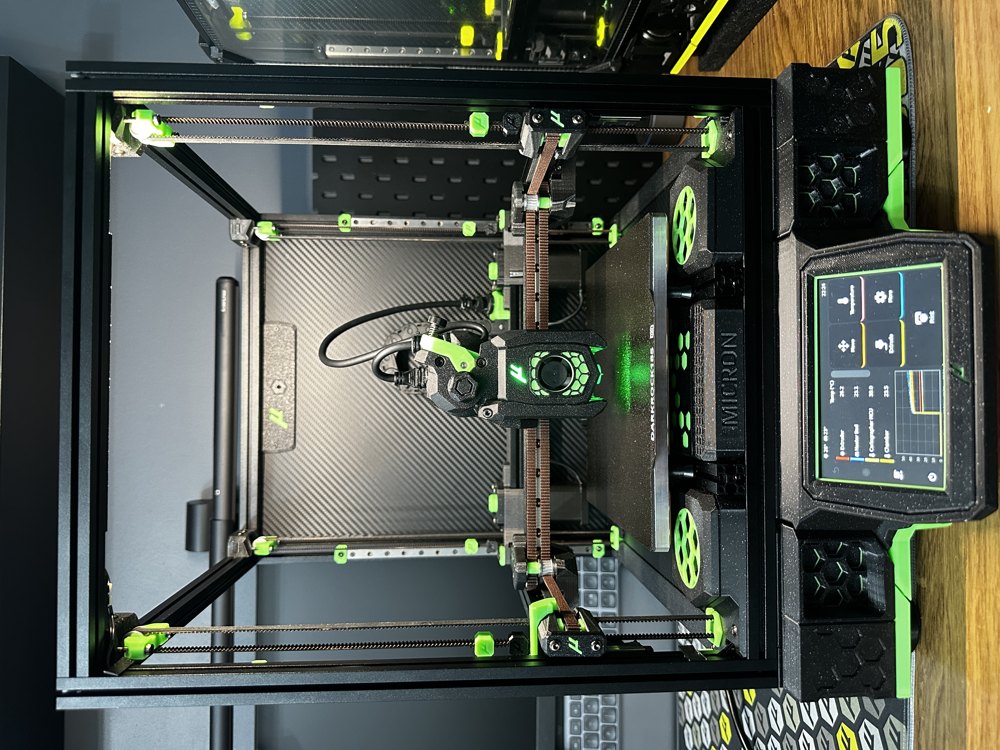
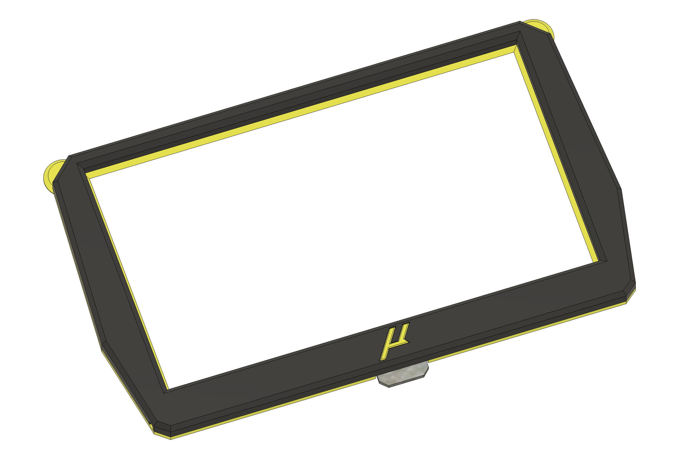

4.3 display bezel with minimal accent around the display border. 

Can be split and printed with an MMU, or a simple filament swap at 1.2mm.

Has built in support for optional accent logo insert.

