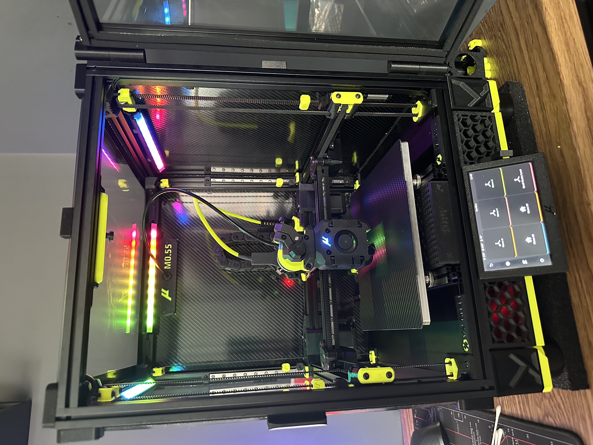

# Matchstick Mounts for Micron / SaladFork / StealthFork

Slightly modified mounts for the awesome **Matchstick Diffusers** by [Maple Leaf Makers](https://github.com/MapleLeafMakers).

> Allows the Matchsticks to be angled down towards the print area for better illumination.

---

## Original Designs:

- [Matchstick Diffusers on GitHub](https://github.com/MapleLeafMakers/Matchstick_Diffuser)
- [Matchstick Diffusers on Printables](https://www.printables.com/model/408214-matchstick-diffusers)

---

## Mounting Options:

- **Under Top 1515 Extrusion** – left and right Matchsticks (see image).
- **Front Face of Extrusion** – rear Matchstick (see image).
- **Optional Alternative Matchstick Cover** – designed for easier installation of the 45-degree clips.

---

---

**Note:** The original CAD files for these mounts were deleted. I plan to recreate and upload updated versions when possible. Watch this space!