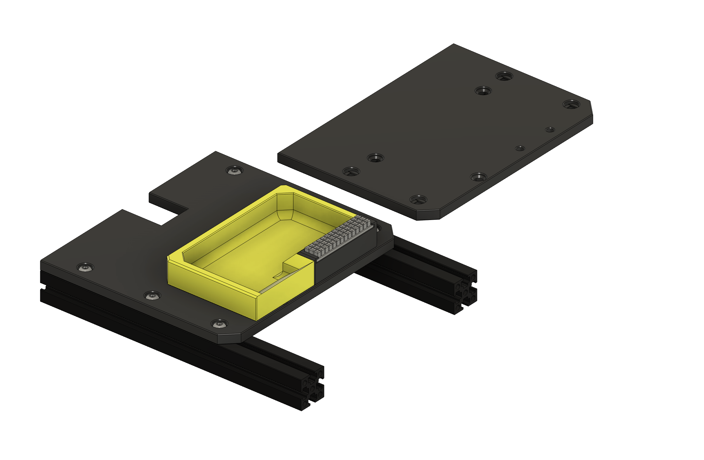
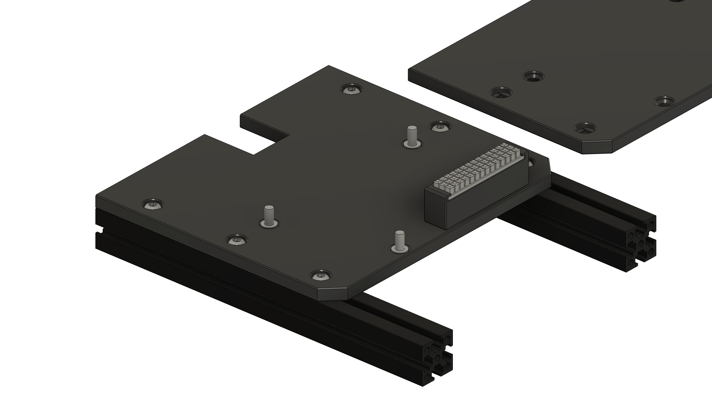

# 🧽 Micron+ Nozzle Scrubber & Purge Bucket  
### *Because even your nozzle deserves a spa day.*

Keep your nozzle tidy and your purge blobs contained with this magnetic bucket and silicone scrubber combo — easy to install, easy to empty, and deeply satisfying to use.

Now available with the silicone brush on right (original) or left. Placing it on the left reduces any fouling of the toolhead on the Z Chain.
Thanks to `@vince M.213` for the suggestion to have the new brush on the left variant. 

There is also a different version of the Bucket, and Brush holder for LDO kits as they come with 15mm standoffs for the bed rather than M4 Knurled nuts. 

**IMPORTANT** If using the brush on the left variant, you will need to adjust the co-ordinates in the provided macros if you are using them. 
---

## 🧼 Features  
- 🐜 Designed for **Micron+** 
- 🧲 **Magnet & screw bucket fitment** for secure mounting and quick removal  
- 🧽 Uses **Bambu Lab A1-style silicone nozzle scrubber**  
- ⚙️ 3x base options included: `base_no_chain`, `base_boop`, & `base_stock` for flexible installs

---

## 📦 Bill of Materials (BOM)

| Qty | Item | Notes / Link |
---|----|----
x7|M3x6 BHCS|[Aliexpress](https://s.click.aliexpress.com/e/_EuZgLr4)
x6|M3 Hex Nuts|[Aliexpress](https://s.click.aliexpress.com/e/_EwAgnb8)
x6|6mm x 3mm N52 Magnet|[Aliexpress](https://s.click.aliexpress.com/e/_EQ4GZeE)
x2|4x5 Heatset Insert (Voron spec)|[Aliexpress](https://s.click.aliexpress.com/e/_EuBQ66m)
1x|Bambu Lab A1 Nozzle Scrubber|[Aliexpress](https://s.click.aliexpress.com/e/_Ev16llx)

---

## 📅 Version History

### 23-Nov-2025
- Added `Brush_Holder_LDO_Kit_x1.stl` and `[a]_Bucket_LDO_Kit_x1.stl` for use with LDO Micron R1 Kits
- Added new variat with the brush on the left, rather than the right
- Updated CAD to include the above changes, now v15

### 16-Jun-2025
- Added `base_stock.stl` for stock Micron bed location
- Redesigned front edge with better cleance for earth cables screwed to build plate
- Reduced mountnig screws from x6, to x4
- Relocated rear mounting screws, to allow use of stock printed bed extrusion mounts, or extended 1515 extrusions
- Typo in `nozzle_poop.cfg` corrected
- Updated CAD to v13

### 05-Jun-2025
- Added `nozzle_brush.cfg`
- Added `nozzle_poop.cfg`

### 20-Nov-2024  
- Initial release  
- Added `base_no_chain.stl` for alternate setups  

---