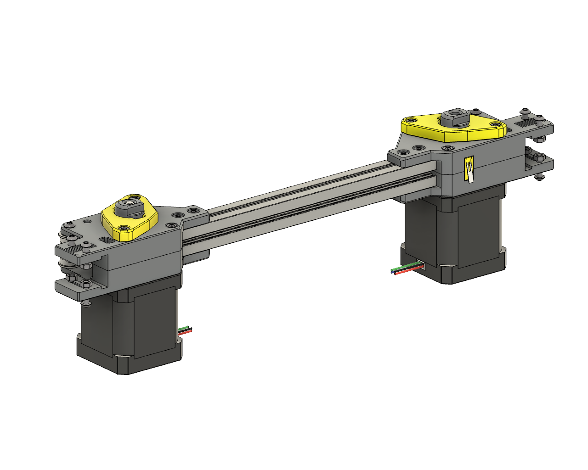

# NEMA17 A/B Motor Upgrade for you Micron

---

## 🔧 Overview 
New A/B motor mounts for your Micron, that are designed to use NEMA17 motors, with accompanying dual sheer bearing holders. 
Full bed travel is retained, however you might need to readjust the location of your bed towards the front slightly. (Approx 4mm)

Bearing mount retainers can be found in the Micron repo **[here](https://github.com/PrintersForAnts/Micron/tree/main/STLs/Gantry/AB_Drives/double_shear_mounts)**

---

## 🪛 Changes from Stock
- Bearing Mounts require 2x **M3x30 SHCS**
- A/B Support Extrusion requires shortening slightly to **168mm**

---

## 🖨️ Print Settings  

**All STLs should be pre-oriented for printing.**

- **Material:** ABS or ASA
- **Layer height:** 0.20 mm (including first layer)
- **Wall count:** 4
- **Extrusion width:** 0.40 mm (forced)
- **Top/bottom solid layers:** 5
- **Infill:** 40% (Grid, Gyroid, Honeycomb, Triangle, or Cubic)
- **Supports:** Not required

---

## 🗓️ Version History  

### 28 Oct 2025  
- 🆕 Initial release  

---